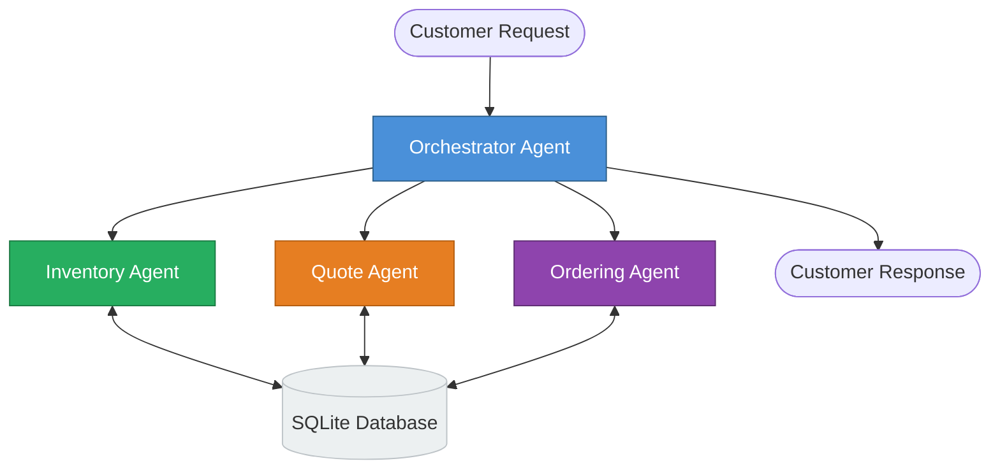
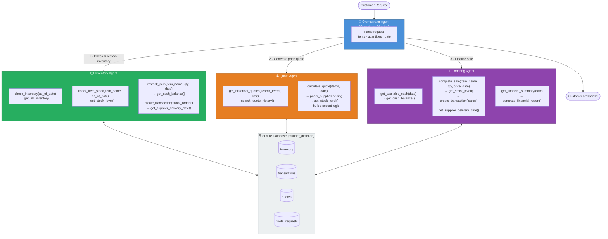

## Simplified Overview



## Detailed Diagram



## Agent Roles

| Agent | Role | Key Responsibility |
|---|---|---|
| **Orchestrator** | Operations Director | Routes requests; sequences Inventory → Quote → Ordering calls |
| **Inventory** | Stock Manager | Verifies availability; auto-restocks via `create_transaction('stock_orders')` when needed |
| **Quote** | Pricing Specialist | Pulls historical quotes via `search_quote_history()`; applies tiered bulk discounts |
| **Ordering** | Transaction Manager | Confirms cash via `get_cash_balance()`; records sales via `create_transaction('sales')` |

## Request Flow

```
Customer Request
    │
    ▼
Orchestrator: parse items + quantities + date
    │
    ├─1─▶ Inventory Agent
    │       ├─ check_inventory(date)          → get_all_inventory()
    │       ├─ check_item_stock(item, date)   → get_stock_level()
    │       └─ restock_item(item, qty, date)  → get_cash_balance()
    │                                         → create_transaction('stock_orders')
    │                                         → get_supplier_delivery_date()
    │
    ├─2─▶ Quote Agent
    │       ├─ get_historical_quotes(terms)   → search_quote_history()
    │       └─ calculate_quote(items, date)   → paper_supplies pricing
    │                                         → get_stock_level()
    │                                         → bulk discount tiers
    │
    ├─3─▶ Ordering Agent
    │       ├─ get_available_cash(date)       → get_cash_balance()
    │       ├─ complete_sale(item, qty, price, date)
    │       │                                 → get_stock_level()
    │       │                                 → create_transaction('sales')
    │       │                                 → get_supplier_delivery_date()
    │       └─ get_financial_summary(date)    → generate_financial_report()
    │
    └─▶ Final response to customer
            (quote breakdown + delivery dates + any unfulfilled items)
```

## Bulk Discount Tiers

| Total Units | Discount |
|---|---|
| < 100 | 0% |
| ≥ 100 | 5% |
| ≥ 500 | 10% |
| ≥ 1,000 | 15% |
| ≥ 5,000 | 20% |
