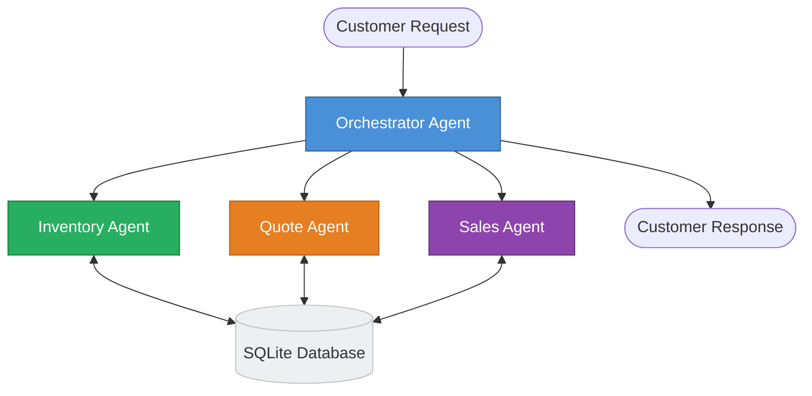
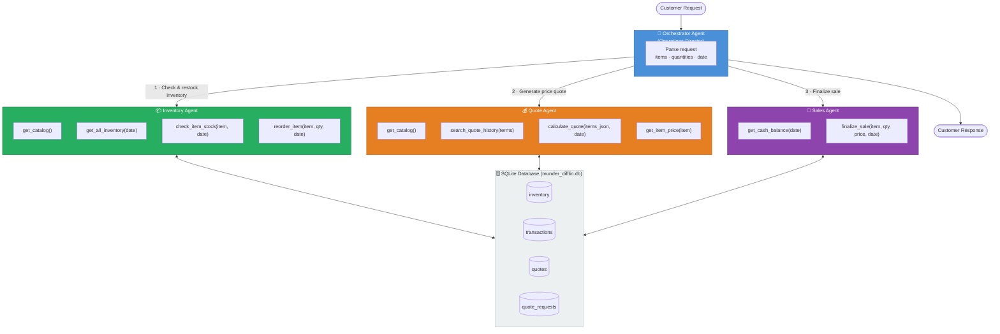

## Simplified Overview



## Detailed Diagram



## Agent Roles

| Agent | Role | Key Responsibility |
|---|---|---|
| **Orchestrator** | Operations Director | Routes requests; sequences Inventory → Quote → Sales calls |
| **Inventory** | Stock Manager | Verifies availability; auto-restocks when below `min_stock_level` |
| **Quote** | Pricing Specialist | Pulls historical quotes; applies tiered bulk discounts (5/10/15/20%) |
| **Sales** | Transaction Manager | Records sales in `transactions` table; provides delivery ETAs |

## Request Flow

```
Customer Request
    │
    ▼
Orchestrator: parse items + quantities + date
    │
    ├─1─▶ Inventory Agent
    │       ├─ get_catalog()               ← find exact item names
    │       ├─ get_all_inventory(date)     ← see what's in stock
    │       ├─ check_item_stock(item,date) ← verify per-item levels
    │       └─ reorder_item(...)           ← restock if below minimum
    │
    ├─2─▶ Quote Agent
    │       ├─ search_quote_history(terms) ← calibrate from past quotes
    │       ├─ get_item_price(item)        ← look up unit prices
    │       └─ calculate_quote(items,date) ← apply bulk discounts
    │
    ├─3─▶ Sales Agent
    │       ├─ get_cash_balance(date)      ← verify company has capacity
    │       └─ finalize_sale(×N items)     ← record each line as transaction
    │
    └─▶ Final response to customer
            (quote breakdown + delivery dates + any unfulfilled items)
```

## Bulk Discount Tiers

| Total Units | Discount |
|---|---|
| < 100 | 0% |
| ≥ 100 | 5% |
| ≥ 500 | 10% |
| ≥ 1,000 | 15% |
| ≥ 5,000 | 20% |
